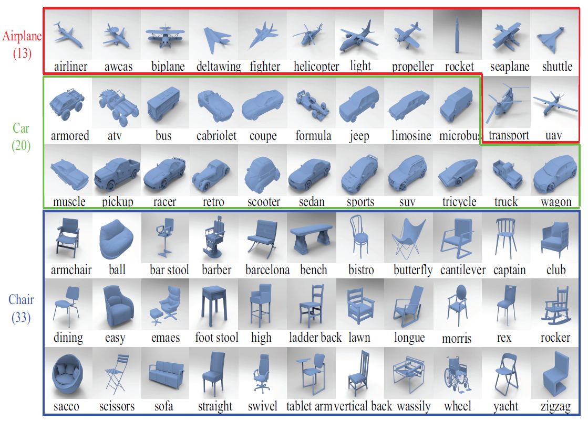

# Fine-Grained 3D Shape Classification with Hierarchical Part-View Attentions
Created by <a href="https://scholar.google.com/citations?user=vg2IvzsAAAAJ&hl=en" target="_blank">Xinhai Liu</a>, <a href="https://scholar.google.com/citations?user=RGNWczEAAAAJ&hl=en" target="_blank">Zhizhong Han</a>, <a href="http://cgcad.thss.tsinghua.edu.cn/liuyushen/" target="_blank">Yu-Shen Liu</a>, <a href="https://scholar.google.com/citations?user=KW0FmzgAAAAJ&hl=en" target="_blank">Matthias Zwicker</a>.

## Abstract
Fine-grained 3D shape classification is important for shape understanding and analysis, and it poses a challenging research problem. Due to the lack of fine-grained 3D shape benchmarks, however, research on fine-grained 3D shape classification has rarely been explored. To address this issue, we first introduce a new 3D shape dataset with fine-grained class labels, which consists of three categories including airplane, car and chair. Each category consists of several subcategories at a fine-grained level. According to our experiments under this fine-grained dataset, we find that state-of-the-art methods are significantly limited by the small variance among subcategories in the same category. To resolve this problem, we further propose a novel fine-grained 3D shape classification method named FG3D-Net to capture the fine-grained local details of 3D shapes from multiple rendered views. Specifically, we first train a Region Proposal Network (RPN) to detect the generally semantic parts inside multiple views under the benchmark of generally semantic part detection. Then, we design a hierarchical part-view attention aggregation module to learn a global shape representation by aggregating generally semantic part features, which preserves the local details of 3D shapes. The part-view attention module leverages part-level and view-level attention to increase the discriminability of our features, where the part-level attention highlights the important parts in each view while the view-level attention highlights the discriminative views among all the views of the same object. In addition, we integrate a Recurrent Neural Network (RNN) to capture the spatial relationships among sequential views from different viewpoints. Our results under the fine-grained 3D shape dataset show that our method outperforms other state-of-the-art methods.

**Figure 1. The framework of the FG3D-Net.**

## Dataset

## Citation
If you find our work useful in your research, please consider citing:

       @article{liu2020fine,
          title={Fine-Grained 3D Shape Classification with Hierarchical Part-View Attentions},
          author={Liu, Xinhai and Han, Zhizhong and Liu, Yu-Shen and Zwicker, Matthias},
          journal={arXiv preprint arXiv:2005.12541},
          year={2020}
       }
