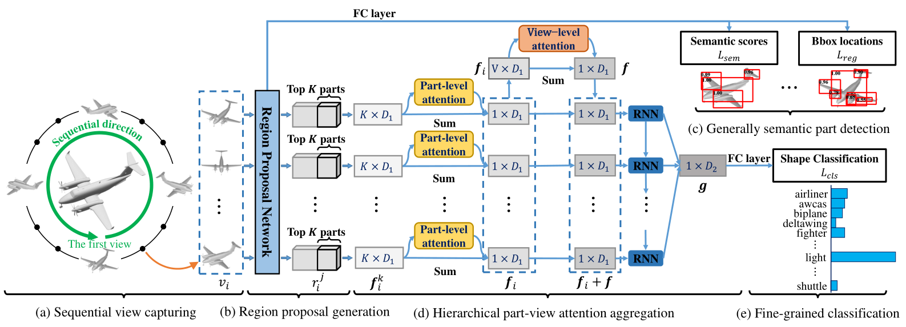
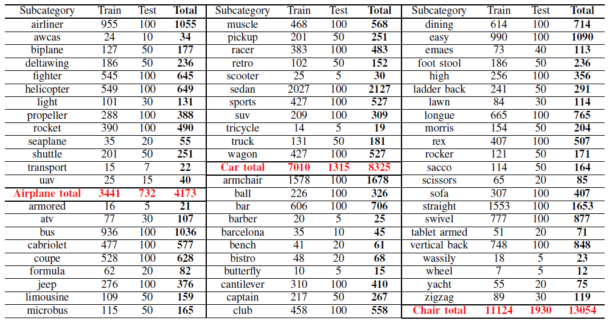

# Fine-Grained 3D Shape Classification with Hierarchical Part-View Attentions
Created by <a href="https://scholar.google.com/citations?user=vg2IvzsAAAAJ&hl=en" target="_blank">Xinhai Liu</a>, <a href="https://scholar.google.com/citations?user=RGNWczEAAAAJ&hl=en" target="_blank">Zhizhong Han</a>, <a href="http://cgcad.thss.tsinghua.edu.cn/liuyushen/" target="_blank">Yu-Shen Liu</a>, <a href="https://scholar.google.com/citations?user=KW0FmzgAAAAJ&hl=en" target="_blank">Matthias Zwicker</a>.

 Figure 1. The framework of the FG3D-Net. 

## Abstract
Fine-grained 3D shape classification is important for shape understanding and analysis, and it poses a challenging research problem. Due to the lack of fine-grained 3D shape benchmarks, however, research on fine-grained 3D shape classification has rarely been explored. To address this issue, we first introduce a new 3D shape dataset with fine-grained class labels, which consists of three categories including airplane, car and chair. Each category consists of several subcategories at a fine-grained level. According to our experiments under this fine-grained dataset, we find that state-of-the-art methods are significantly limited by the small variance among subcategories in the same category. To resolve this problem, we further propose a novel fine-grained 3D shape classification method named FG3D-Net to capture the fine-grained local details of 3D shapes from multiple rendered views. Specifically, we first train a Region Proposal Network (RPN) to detect the generally semantic parts inside multiple views under the benchmark of generally semantic part detection. Then, we design a hierarchical part-view attention aggregation module to learn a global shape representation by aggregating generally semantic part features, which preserves the local details of 3D shapes. The part-view attention module leverages part-level and view-level attention to increase the discriminability of our features, where the part-level attention highlights the important parts in each view while the view-level attention highlights the discriminative views among all the views of the same object. In addition, we integrate a Recurrent Neural Network (RNN) to capture the spatial relationships among sequential views from different viewpoints. Our results under the fine-grained 3D shape dataset show that our method outperforms other state-of-the-art methods.

## FG3D dataset

 Table 1. The statistics of the FG3D dataset which consists of 3 categories and 66 subcategories. 

As shown in Table 1, FG3D dataset consists of three basic categories including Airplane, Car and Chair, which contain 3,441 shapes in 13 subcategories, 8,235 shapes in 20 subcategories, and 13,054 shapes in 33 subcategories, respectively. We represent each 3D shape by an object format file (.off) with polygonal surface geometry. One can easily convert the .off files into other shape representations, such as rendered views, voxels and point clouds. All shapes in FG3D are collected from multiple online repositories including <a href="https://3dwarehouse.sketchup.com/" target="_blank">3D Warehouse</a>, Yobi3D and <a href="https://www.shapenet.org/" target="_blank">ShapeNet</a>, which contain a massive collection of CAD shapes that are publicly available for research purpose. By collecting 3D shapes over a period of two months, we obtained a collection of more than 20K 3D shapes in three shape categories. We organized these 3D shapes using the <a href="https://wordnet.princeton.edu/" target="_blank">WordNet</a> noun “synsets” (synonym sets). WordNet provides a broad and deep taxonomy with over 80K distinct synsets representing distinct noun concepts. This taxonomy has been utilized by <a href="http://www.image-net.org/" target="_blank">ImageNet</a> and <a href="https://www.shapenet.org/" target="_blank">ShapeNet</a> to formulate the object subcategories. In our dataset, we also introduce the taxonomy into the collection of 3D shapes, as shown in Figure 2.

 Figure 2. There are three shape categories in our fine-grained dataset including Airplane, Car and Chair. 

For evaluation, we split the shapes in each categories into training and testing sets. Specifically, the 3D shapes in airplane are split into 3,441 for training and 732 for testing. The cars category contains 7,010 shapes for training and 1,315 shapes for testing. The chairs category contains 11,124 shapes for training and 1,930 shapes for testing.

We provide the download link of the FG3D dataset at  <a href="https://drive.google.com/drive/folders/1zLDdE8mMIxVKh3usnUhqtWm-o9TbIMdV?usp=sharing" target="_blank">Google Drive</a>. We show the meaning of different files in the download link as follows.

## TODOs
\begin{items}

\end{items}
## Citation
If you find our work useful in your research, please consider citing:

       @article{liu2020fine,
          title={Fine-Grained 3D Shape Classification with Hierarchical Part-View Attentions},
          author={Liu, Xinhai and Han, Zhizhong and Liu, Yu-Shen and Zwicker, Matthias},
          journal={arXiv preprint arXiv:2005.12541},
          year={2020}
       }
